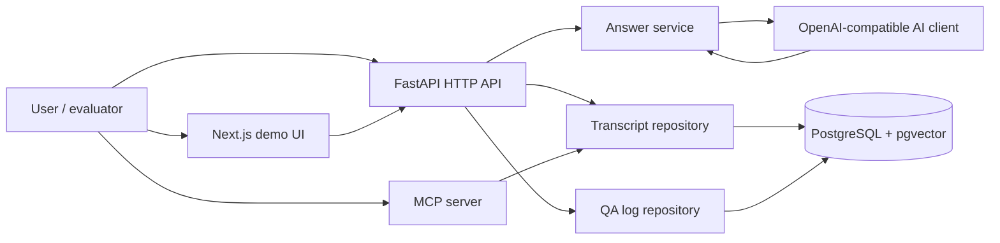

# AI Operator

AI Operator is a transcript-backed AI support operator for the  hackathon task. It is designed as a first-line support assistant for dental software: the user asks a question in natural language, the system identifies the topic, retrieves relevant evidence from anonymized support transcripts, and returns a short, precise answer.

The project is intentionally built around the backend retrieval stack, not around a chat UI. The frontend exists for demo and verification, but the core value is the technical pipeline behind the answer.

## What The System Does

- Accepts a natural-language support question.
- Identifies the relevant topic or theme.
- Searches transcript knowledge using embeddings and vector similarity.
- Generates a concise chat-style answer grounded in retrieved context.
- Falls back safely when the available evidence is not enough.
- Stores question/answer pairs for later evaluation and export.
- Exposes the same knowledge layer through both HTTP API and MCP.

## Why This Architecture

The assignment asks for a system that is fast, clear, technically justified, and grounded in real transcript data. For that reason, the project uses a retrieval-first design:

1. Transcripts are ingested and embedded once.
2. Retrieval happens against PostgreSQL with pgvector.
3. The answer service uses the retrieved context to generate a final response.
4. The same retrieval logic is reused by the web API and the MCP server.
5. QA audit logs make the system traceable and easier to evaluate.

## Architecture Overview



## Stack

- Frontend: Next.js 16, React 19, TypeScript, Tailwind CSS v4.
- Backend: Python 3.13, FastAPI, Uvicorn, Pydantic v2, SQLAlchemy async, Alembic.
- Retrieval: PostgreSQL + pgvector, asyncpg, sentence-transformers.
- AI layer: OpenAI-compatible chat client for topic selection and final answer generation.
- Tooling: MCP server for external agentic clients.
- Observability: QA audit logging and CSV export.

## Main Data Flows

### 1. Answer Flow

1. The user sends a question to `POST /api/v1/answer`.
2. The backend selects the most relevant theme.
3. The system retrieves the best transcript excerpts for that theme.
4. The AI model generates a short answer based only on the retrieved context.
5. The prompt and answer are written to the QA audit log table.

### 2. Transcript Retrieval Flow

- `GET /api/v1/themes` returns the available topic list.
- `GET /api/v1/transcripts` searches transcript snippets by theme and prompt.
- This flow is used by the frontend and can also be called directly.

### 3. MCP Flow

- `get_themes` exposes theme discovery to MCP clients.
- `search_transcripts` exposes the retrieval layer to MCP clients.
- The MCP server uses the same repository and embedding logic as the HTTP API.

### 4. QA Log Export Flow

- `GET /api/v1/qa-logs/export` downloads the stored QA audit trail as CSV.
- This is useful for evaluation, debugging, and demo analysis.

## API Surface

### HTTP API

- `GET /api/v1/themes`
- `GET /api/v1/transcripts?theme_id=&prompt=&limit=&max_distance=`
- `POST /api/v1/transcripts` for importing transcript JSON via `multipart/form-data`
- `POST /api/v1/answer`
- `GET /api/v1/qa-logs/export`

### MCP Server

- `get_themes`
- `search_transcripts`

## Core Engineering Principles

- Keep endpoints thin.
- Put persistence logic in repositories.
- Put orchestration and formatting logic in services.
- Reuse the same retrieval layer across API and MCP.
- Prefer grounded answers over speculative answers.
- Use fallback behavior when the system does not have enough evidence.
- Keep interaction concise and directly useful.

## Transcript Ingestion

Transcripts can be imported in two ways:

- CLI import from the local JSON dataset.
- HTTP upload of a `Transcripts.json` file with a `theme_name` form field.

During ingestion, the system normalizes transcript text, generates embeddings, stores themes and transcripts in PostgreSQL, and makes the data available for retrieval.

## Logging And Evaluation

The backend writes QA audit rows after successful answers. This gives the team a reproducible trace of what was asked and what was returned. The export endpoint turns that log into CSV so it can be reviewed during evaluation.

This is useful for the hackathon because the organizers want a technical solution that can be evaluated against test scenarios, not just a nice chat demo.

## Local Setup

### Database

Start PostgreSQL with Docker Compose:

```bash
docker compose up -d -db
```

### Backend

From `backend/`:

```bash
uv run python main.py api
```

```bash
uv run python main.py mcp
```

### Frontend

From `frontend/`:

```bash
pnpm install
pnpm dev
```

## Docker Stack

The full local stack includes:

- `-db` for PostgreSQL + pgvector
- `-api` for the HTTP backend
- `-mcp` for the MCP server
- `-frontend` for the demo UI

Run everything with:

```bash
docker compose up --build
```

## Environment Variables

### Database

- `POSTGRES_USER`
- `POSTGRES_PASSWORD`
- `POSTGRES_HOST`
- `POSTGRES_PORT`
- `POSTGRES_DB`
- `POSTGRES_DATABASE_URI` or `DATABASE_URL`

### API and MCP

- `API_HOST`
- `API_PORT`
- `MCP_HOST`
- `MCP_PORT`

### Frontend

- `NEXT_PUBLIC_API_URL`

### AI

- `AI_API_KEY` or `OPENAI_API_KEY`
- `AI_BASE_URL` or `OPENAI_BASE_URL`
- `AI_MODEL` or `OPENAI_MODEL`

### Embeddings

- `HF_TOKEN`

## Notes On Answering Behavior

The assistant is intentionally short and factual. It should not “talk a lot” to the user. When the evidence is weak, it should be conservative, surface the limitation, and recommend the next step instead of inventing details.

## What This Repo Is Optimized For

- Transcript-backed support QA.
- Fast retrieval over real support data.
- Technical demos and hackathon evaluation.
- Clear separation between ingestion, retrieval, orchestration, and export.
- Reusable knowledge access through both HTTP and MCP.
