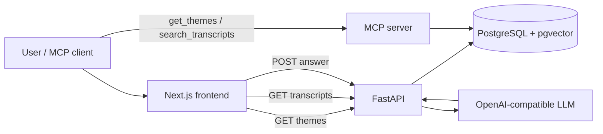

# XDent AI Operator

XDent AI Operator is a transcript-backed RAG system for support workflows. It combines a Next.js chat UI, a FastAPI backend, a PostgreSQL database with pgvector, and an MCP server that exposes the same retrieval layer for external clients.

The core idea is simple: transcripts are imported into the database, embedded once, and then reused through two delivery paths.

1. The HTTP API powers the web app and the direct AI answer flow.
2. The MCP server exposes the same transcript search and theme discovery tools to MCP-capable clients.

## What Is Inside

- Frontend: Next.js 16, React 19, TypeScript, Tailwind CSS v4, Radix UI, shadcn-style primitives.
- Backend: Python 3.13, FastAPI, Uvicorn, Pydantic v2, SQLAlchemy async, Alembic, asyncpg.
- Retrieval: pgvector for similarity search, sentence-transformers for embeddings.
- AI layer: OpenAI-compatible chat client for theme selection and final answer generation.
- Tooling: MCP via `mcp` and a FastMCP ASGI server.
- Infrastructure: Docker Compose for the full local stack.

## Architecture



## Two Ways To Use The Data

### 1. HTTP API

The API is the path used by the web app and by direct integrations.

- `GET /api/v1/themes` returns the available transcript themes.
- `GET /api/v1/transcripts?theme_id=&prompt=&limit=&max_distance=` searches transcripts inside a theme.
- `POST /api/v1/transcripts` imports transcript JSON with `multipart/form-data` using `theme_name` and `file`.
- `POST /api/v1/answer` accepts a single `prompt` and returns a single `message`.

The answer endpoint does the full RAG flow for you: it selects the best theme, retrieves the most relevant transcript excerpts, and asks the AI model to produce the final answer.

The import endpoint and the CLI importer now share the same backend service, so JSON upload behavior matches local ingestion behavior.

### 2. MCP Server

The MCP server exposes the same knowledge layer as tools for external MCP clients.

- `get_themes` returns all available themes.
- `search_transcripts` searches within a specific theme using the user prompt.

This is the better path when you want the data as a reusable toolset inside another agent or MCP-enabled application.

## Workflow

1. Import transcript JSON files into PostgreSQL with embeddings through the CLI importer or the HTTP upload endpoint.
2. Browse themes in the frontend.
3. Ask a question in the chat UI or call the API directly.
4. The backend searches transcripts using vector similarity.
5. The answer service builds a context window from the best matches and generates the final response.
6. The same retrieval logic is also available through MCP.

## Repository Layout

- `backend/` contains the FastAPI app, MCP server, database models, migration files, and shared transcript import service.
- `frontend/` contains the Next.js app and UI components.
- `docker-compose.yml` starts the database, backend, MCP server, and frontend together.

## Local Setup

### 1. Start PostgreSQL

The simplest path is Docker Compose:

```bash
docker compose up -d xdent-db
```

### 2. Import transcripts

From the `backend/` directory:

```bash
uv run python load_transcripts.py
```

You can also point the importer at a custom dataset:

```bash
uv run python load_transcripts.py --data-dir src/utils/data
```

If you prefer HTTP ingestion, upload a `Transcripts.json` file to `POST /api/v1/transcripts` with a `theme_name` form field.

### 3. Run the backend services

Open two terminals in `backend/`:

```bash
uv run python main.py api
```

```bash
uv run python main.py mcp
```

The first command starts the HTTP API. The second command starts the MCP server as an HTTP app backed by FastMCP.

### 4. Run the frontend

From `frontend/`:

```bash
pnpm install
pnpm dev
```

By default the frontend expects the API at `http://localhost:8000`. Override it with `NEXT_PUBLIC_API_URL` if needed.

## Docker Compose Stack

The repository ships with a complete local stack:

- `xdent-db` runs PostgreSQL with pgvector.
- `xdent-api` runs the FastAPI backend.
- `xdent-mcp` runs the MCP server on port `8001`.
- `xdent-frontend` runs the Next.js app on port `3000`.

Start everything with:

```bash
docker compose up --build
```

## Environment Variables

### Database

- `POSTGRES_USER`
- `POSTGRES_PASSWORD`
- `POSTGRES_HOST`
- `POSTGRES_PORT`
- `POSTGRES_DB`
- `POSTGRES_DATABASE_URI` or `DATABASE_URL`

### API and MCP

- `API_HOST`
- `API_PORT`
- `MCP_HOST`
- `MCP_PORT`

### Frontend

- `NEXT_PUBLIC_API_URL`

### AI

- `AI_API_KEY` or `OPENAI_API_KEY`
- `AI_BASE_URL` or `OPENAI_BASE_URL`
- `AI_MODEL` or `OPENAI_MODEL`

### Embeddings

- `HF_TOKEN`

## Notes On The AI Answer Flow

The backend answer service is intentionally conservative. It uses the transcript excerpts as the source of truth, keeps the final answer short, and returns only the generated text. That makes the API predictable for product use and keeps the MCP tools focused on retrieval.

## Development Tips

- Use the API when you want the system to answer a question end-to-end.
- Use MCP when you want another agent or client to inspect themes and retrieve transcript evidence directly.
- Keep the database and embeddings in sync by re-running the transcript import when the source JSON changes.
